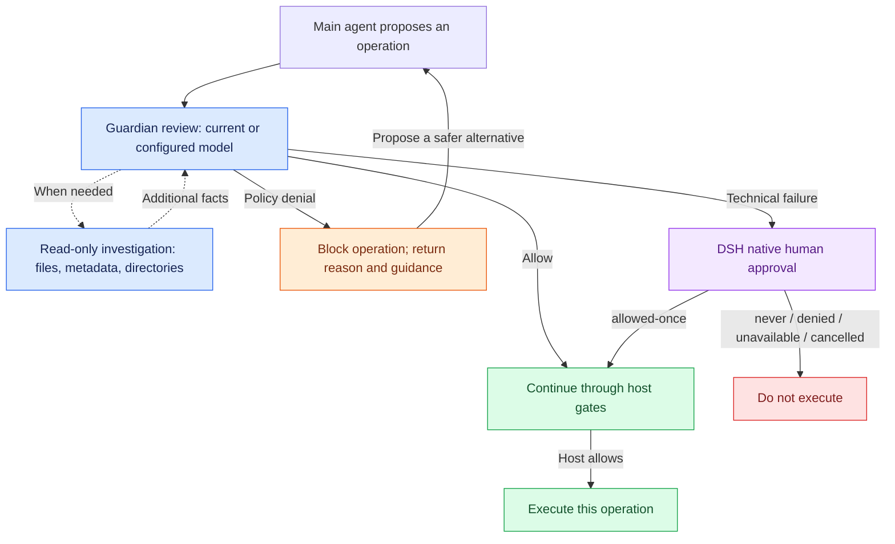

# Codex Auto Approval for DSH

[English](README.md) | [简体中文](README.zh-CN.md)

For long-running tasks, manual approvals are exhausting, while granting full access is nerve-racking. So I ported the Guardian reviewer behind **“Approve for me”**, my favorite auto-approval feature in Codex CLI, into a standalone **DeepSeek Harness (DSH)** plugin, including risk assessment, user authorization, structured decisions, read-only investigation, retries, and denial limits.

You can now safely run long tasks that take hours.

New top-level sessions start in **CodexAutoApproval**. The reviewer uses the session's current model by default. When it denies an action, the main agent receives the reason and guidance to continue with a safer alternative.

| Component | Supported version |
| --- | --- |
| DSH Desktop / CLI | `0.2.0-rc.2` |
| Plugin | `0.1.1` |
| Node.js | `^22.19.0` or `>=24.0.0` |

The official `@deepseek-ai/dsh-experimental-auto-review` plugin can remain enabled alongside this plugin.

## Approval flow



## Install

1. Download the [prebuilt plugin package](artifacts/dsh-codex-auto-approval-0.1.1.tgz).
2. Recommended: send the link directly to your AI assistant.

### Desktop

1. Open DSH's plugin manager and install the downloaded `.tgz` file.
2. Enable `dsh-codex-auto-approval`.
3. Start a new top-level session and check that its permission preset is **CodexAutoApproval**.

Existing `auto` sessions continue using the official reviewer after an upgrade; select CodexAutoApproval to switch reviewers. Fresh root sessions default to CodexAutoApproval.

The author has verified that the plugin works in DSH Desktop.

### CLI

Replace `my-profile` with your profile and use the full path to the downloaded package:

```sh
dsh plugin --profile my-profile add /absolute/path/dsh-codex-auto-approval-0.1.1.tgz
dsh --profile my-profile --dump-config
dsh --profile my-profile
```

For example, in Windows PowerShell:

```powershell
dsh plugin --profile my-profile add 'C:\Downloads\dsh-codex-auto-approval-0.1.1.tgz'
```

The bundle automatically adds the plugin layer. Desktop's dedicated profile is managed by Electron; do not launch the `desktop` profile with the CLI.

### Disable or remove

Use the Desktop plugin manager, or remove it from a CLI profile:

```sh
dsh plugin --profile my-profile remove dsh-codex-auto-approval
```

Disabling the plugin aborts pending reviews and removes its registrations. Sessions still using CodexAutoApproval return to the known preset selected before that mode, or to the host's configured default when no previous preset is known.

## Approval behavior

- **Fresh root sessions default to CodexAutoApproval.** Resumed, forked, and compacted sessions retain their permission selection. A manual change is not overwritten on the next turn.
- **Subagents retain native DSH permission inheritance plus the independent reviewer identity.** They inherit file permissions and CodexAutoApproval identity, with approval policy fixed to `never`. They still receive automatic reviews; a technical failure cannot prompt for human approval.
- **Each exact operation is reviewed.** This includes native tool calls, the complete outer `run_code` program, and its inner SDK calls. Approvals are not cached. Other host gates can still deny a call or require human approval.
- **A policy denial blocks that operation.** The main agent receives the rationale and Codex's corrective guidance. It may proceed with a materially safer alternative. Inner PTC denials are also placed in the main agent's context, even if the program catches the error. Repeated denials can stop the turn as described below.
- **Technical failures use native human approval.** Recoverable failures get up to three attempts within a 90-second total review deadline. Exhausted failures, invalid output, and oversized required context fall back to DSH's approval service. Only `allowed-once` admits the operation; `never`, denial, unavailable approval, and cancellation do not. An operation that cannot be matched to its session record is denied directly.
- **Authorization and facts remain distinct.** User RPC messages, direct parent-agent instructions, and AGENTS constraints retain their provenance. Summaries, attachments, assistant text, and tool results are treated as facts. Required authorization and the action are not silently truncated to obtain an automatic approval.
- **Repeated denials stop the current turn.** The defaults are three consecutive policy denials, or ten denials among the latest fifty reviews in a turn. Queued user input is preserved. Technical failures do not count as policy denials.

## Model and investigation

The default reviewer route is the main agent's current `provider` / `model`. You can select a separate route already registered in DSH. Requests use the host's adapters and credentials and may incur additional model charges.

The reviewer has three private investigation capabilities through `ctx.fs`: read a bounded file window, inspect file metadata, and list directory entries. It cannot invoke host tools, run shell commands, start processes, write files, or request network access. Reviewed context and any file content it reads are sent to the configured model provider.

CodexAutoApproval uses the host's full-access permission preset, subject to other host gates. Model review does not provide OS isolation or a deterministic safety guarantee. Cancellation propagation also depends on the configured model adapter.

## Configuration

Override the plugin row in the profile's `cordis.patch.yml`, or use DSH's configuration editor. A patch replaces the row's entire `config`, rather than merging individual fields:

```yaml
- id: codex-auto-approval
  config:
    autoEnableNewSessions: true
    # Set both fields to use a separate registered reviewer route.
    # reviewerProvider: your-registered-provider
    # reviewerModel: your-registered-model
    reviewTimeoutMs: 90000
    maxConcurrentReviews: 4
```

| Setting | Default | Purpose |
| --- | ---: | --- |
| `autoEnableNewSessions` | `true` | Enable CodexAutoApproval for fresh root sessions |
| `reviewerProvider`, `reviewerModel` | Unset | Separate reviewer route; supply both nonempty values |
| `reviewTimeoutMs` | `90000` | Total review deadline, including queueing, investigation, and retries; human response time is separate |
| `maxAttempts` | `3` | Maximum attempts for recoverable review failures |
| `maxReviewRounds` | `8` | Maximum model round trips per attempt |
| `maxInputBytes` | `131072` | Byte budget for review requests and responses |
| `maxReadBytes` | `32768` | Maximum bytes in one investigation read |
| `maxDirectoryEntries` | `256` | Maximum entries returned from one investigation listing |
| `maxConcurrentReviews` | `4` | Concurrent reviews across this plugin instance |
| `maxConsecutiveDenials` | `3` | Consecutive policy denials that stop a turn |
| `denialWindowSize` | `50` | Recent-review window within a turn |
| `maxRecentDenials` | `10` | Denial threshold in that window; cannot exceed its size |

Numeric settings must be positive integers. `reviewTimeoutMs` must also fit the Node timer range. Invalid configuration fails during loading.

## Implementation and sources

The ESM entry exports `name`, `apply`, `inject`, and `Config`, with no default export. Required services are `permissionPresets`, `approval`, `sessions`, `tools`, `llm`, `fs`, and `agents`. The observation event `codex-auto-approval/decision` contains call identity, outcome, assessment, and elapsed time; it excludes tool arguments and the private review conversation. Tool results and human decisions use DSH's existing persistent logs.

- [src/index.ts](src/index.ts): permission preset, execution gates, lifecycle, and default activation.
- [src/snapshot.ts](src/snapshot.ts) and [src/context.ts](src/context.ts): frozen action identity, provenance, and bounded context.
- [src/reviewer.ts](src/reviewer.ts), [src/investigation.ts](src/investigation.ts), and [src/policies](src/policies): private review and Guardian policy.
- [Adaptation notes](docs/ADAPTATION.md): upstream mapping and runtime limitations.

Codex source is pinned to [`d42056091aded7feb1d88ac7e83972108b2aa478`](https://github.com/openai/codex/tree/d42056091aded7feb1d88ac7e83972108b2aa478). DSH API reference is pinned to [`639ed015397290b3745d163aafe02ffee4aa3f84`](https://github.com/deepseek-ai/deepseek-harness/tree/639ed015397290b3745d163aafe02ffee4aa3f84); implementation and verification use the actual npm runtime `0.2.0-rc.2`. The installed Desktop's exact source commit has not been confirmed.

## License

[Apache-2.0](LICENSE). The adapted DSH code retains its [MIT notice](licenses/DSH-MIT.txt). Upstream attribution and changes are recorded in [NOTICE](NOTICE). This is an independent port of the upstream functionality.
