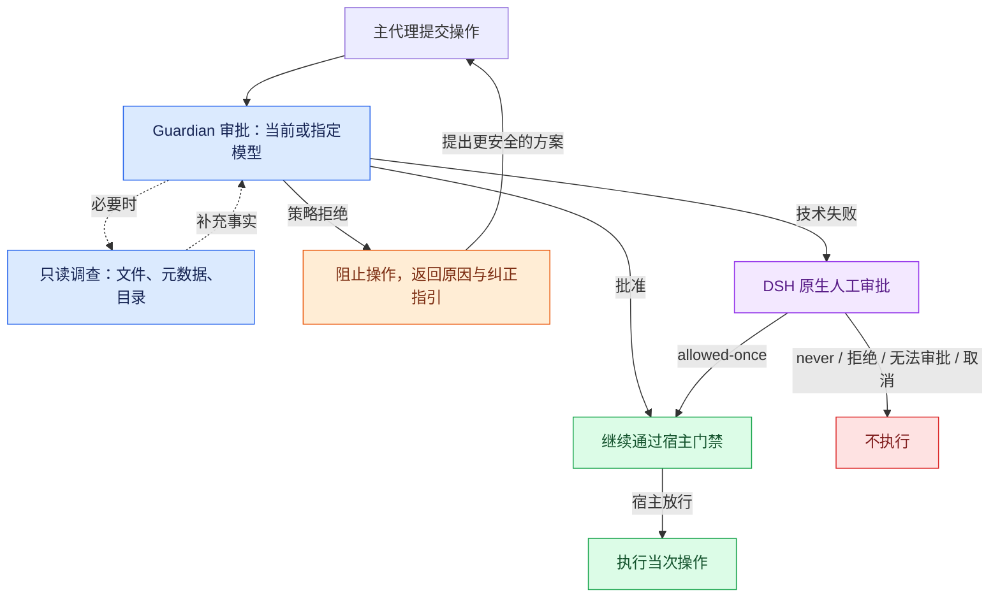

# Codex 自动审批插件 · DSH

[English](README.md) | [简体中文](README.zh-CN.md)

在运行长时间的任务时，手动审批劳心费力，完全授权提心吊胆。于是我把最喜欢的 Codex CLI 的自动审批**“Approve for me”** 背后的 Guardian 审批器移植为独立的 **DeepSeek Harness（DSH）** 插件，包括风险评估、用户授权判断、结构化决策、只读调查、重试与拒绝熔断。

现在可以安全的进行数小时的长时间任务。

全新顶层会话默认进入 **CodexAutoApproval**，默认使用会话当前模型审批。操作被拒绝后，主代理收到原因和纠正指引，可继续采用更安全的方案。

| 组件 | 支持版本 |
| --- | --- |
| DSH Desktop / CLI | `0.2.0-rc.2` |
| 插件 | `0.1.1` |
| Node.js | `^22.19.0` 或 `>=24.0.0` |

官方 `@deepseek-ai/dsh-experimental-auto-review` 可同时启用。

## 审批流程



## 安装

1. 下载[已构建的插件包](artifacts/dsh-codex-auto-approval-0.1.1.tgz)。
2. 推荐：直接发链接给AI。

### Desktop

1. 打开 DSH 插件管理，安装下载的 `.tgz` 文件。
2. 启用 `dsh-codex-auto-approval`。
3. 新建顶层会话，检查权限预设是否为 **CodexAutoApproval**。

升级后原有 `auto` 会话继续使用官方 Auto review；手动选择 CodexAutoApproval 才切换审批器。全新根会话仍默认 CodexAutoApproval。

作者已验证 DSH Desktop 可正常使用。

### CLI

将 `my-profile` 换成实际 profile，并使用下载文件的完整路径：

```sh
dsh plugin --profile my-profile add /absolute/path/dsh-codex-auto-approval-0.1.1.tgz
dsh --profile my-profile --dump-config
dsh --profile my-profile
```

Windows PowerShell 示例：

```powershell
dsh plugin --profile my-profile add 'C:\Downloads\dsh-codex-auto-approval-0.1.1.tgz'
```

bundle 会自动加入插件层。Desktop 的专用 profile 由 Electron 管理，不要用 CLI 启动 `desktop` profile。

### 停用或移除

使用 Desktop 插件管理，或从 CLI profile 移除：

```sh
dsh plugin --profile my-profile remove dsh-codex-auto-approval
```

停用会中止正在进行的审批并撤销注册。仍处于 CodexAutoApproval 的会话恢复进入该模式前的已知预设；无法确定此前预设时，使用宿主配置的默认预设。

## 审批行为

- **全新根会话默认 CodexAutoApproval。** 恢复、fork、压缩会话保留已选权限，手动切换后不会在下一轮重新开启 CodexAutoApproval。
- **子代理保留 DSH 原生权限继承，并补充独立审批身份。** 继承文件权限和 CodexAutoApproval 身份，人工审批策略固定为 `never`。子代理仍逐调用自动审查，技术失败时不能弹出人工确认。
- **每次精确操作分别审查。** 覆盖原生工具调用、完整的外层 `run_code` 程序及其内部 SDK 调用，不缓存许可；其他宿主门禁仍可拒绝或要求人工审批。
- **策略拒绝阻止当次操作。** 主代理收到理由和 Codex 纠正指引，可采用实质上更安全的方案。PTC 内部拒绝即使被程序 `catch` 捕获，也会进入主代理上下文。多次拒绝可能触发下述熔断。
- **技术失败转原生人工审批。** 可恢复错误在 90 秒总时限内最多尝试三次；重试耗尽、无效输出或必要上下文超限时转交 DSH 审批服务。仅 `allowed-once` 放行；`never`、拒绝、无法提供人工审批和取消均不执行。无法匹配持久会话记录的操作直接拒绝。
- **授权与事实分开处理。** 用户 RPC 消息、直接父代理任务和 AGENTS 约束保留来源；摘要、附件、助手文本和工具结果作为事实。必要授权与操作不会为获得自动放行而被静默截断。
- **重复拒绝停止当前轮。** 默认阈值为同轮连续三次策略拒绝，或最近五十次审批中十次拒绝。排队用户输入保留，技术错误不计入策略拒绝。

## 模型与调查

默认审批路由是主代理当前的 `provider` / `model`，也可指定已在 DSH 注册的独立路由。请求使用宿主适配器与凭据，可能增加模型调用费用。

审批器仅有三项通过 `ctx.fs` 提供的私有调查能力：读取有界文件窗口、查看元数据和列目录。它不能调用宿主工具、执行命令、启动进程、写文件或请求网络。审批上下文和调查读取的文件内容会发送给所配置的模型提供方。

CodexAutoApproval 使用宿主完整访问权限，仍受其他宿主门禁约束。模型审查不提供操作系统隔离或确定性的安全保证；底层取消传播也依赖所配置的模型适配器。

## 配置

在 profile 的 `cordis.patch.yml` 覆盖插件行，或使用 DSH 配置编辑器。patch 会替换该行整个 `config`，不是逐字段合并：

```yaml
- id: codex-auto-approval
  config:
    autoEnableNewSessions: true
    # 使用独立审批路由时，两项须同时填写已注册的名称。
    # reviewerProvider: your-registered-provider
    # reviewerModel: your-registered-model
    reviewTimeoutMs: 90000
    maxConcurrentReviews: 4
```

| 参数 | 默认 | 含义 |
| --- | ---: | --- |
| `autoEnableNewSessions` | `true` | 全新根会话默认开启 CodexAutoApproval |
| `reviewerProvider`, `reviewerModel` | 未设置 | 独立审批路由，两项须同时提供非空值 |
| `reviewTimeoutMs` | `90000` | 包含排队、调查和重试的总审批时限；人工回答时间另计 |
| `maxAttempts` | `3` | 可恢复技术错误的最大尝试次数 |
| `maxReviewRounds` | `8` | 每次尝试最多模型往返轮数 |
| `maxInputBytes` | `131072` | 审批请求与响应的字节预算 |
| `maxReadBytes` | `32768` | 一次调查读取的最大字节数 |
| `maxDirectoryEntries` | `256` | 一次调查列目录最多返回条目 |
| `maxConcurrentReviews` | `4` | 同一插件实例的全局并发审批数 |
| `maxConsecutiveDenials` | `3` | 停止当前轮的连续策略拒绝阈值 |
| `denialWindowSize` | `50` | 每轮最近审批窗口大小 |
| `maxRecentDenials` | `10` | 窗口内策略拒绝阈值，不得大于窗口大小 |

数值必须为正整数，`reviewTimeoutMs` 还须处于 Node 计时器有效范围。无效配置会在加载时失败。

## 实现与来源

ESM 入口具名导出 `name`、`apply`、`inject`、`Config`，没有默认导出。必需服务为 `permissionPresets`、`approval`、`sessions`、`tools`、`llm`、`fs`、`agents`。只读观察事件 `codex-auto-approval/decision` 包含调用身份、结果、评估和耗时，不含工具参数或私有审批对话；工具结果和人工决策使用 DSH 原有持久日志。

- [src/index.ts](src/index.ts)：权限预设、执行门禁、生命周期和默认启用。
- [src/snapshot.ts](src/snapshot.ts)、[src/context.ts](src/context.ts)：冻结操作身份、来源与上下文预算。
- [src/reviewer.ts](src/reviewer.ts)、[src/investigation.ts](src/investigation.ts)、[src/policies](src/policies)：私有审批与 Guardian 策略。
- [适配说明](docs/ADAPTATION.md)：上游对应关系与运行限制。

Codex 来源锁定为 [`d42056091aded7feb1d88ac7e83972108b2aa478`](https://github.com/openai/codex/tree/d42056091aded7feb1d88ac7e83972108b2aa478)。DSH API 资料基线为 [`639ed015397290b3745d163aafe02ffee4aa3f84`](https://github.com/deepseek-ai/deepseek-harness/tree/639ed015397290b3745d163aafe02ffee4aa3f84)，实现与验收使用实际 npm 运行时 `0.2.0-rc.2`。已安装 Desktop 的具体源码 commit 尚未确认。

## 许可证

[Apache-2.0](LICENSE)。改写的 DSH 代码保留 [MIT 声明](licenses/DSH-MIT.txt)，上游归属和改动见 [NOTICE](NOTICE)。本项目是相关上游功能的独立移植。
